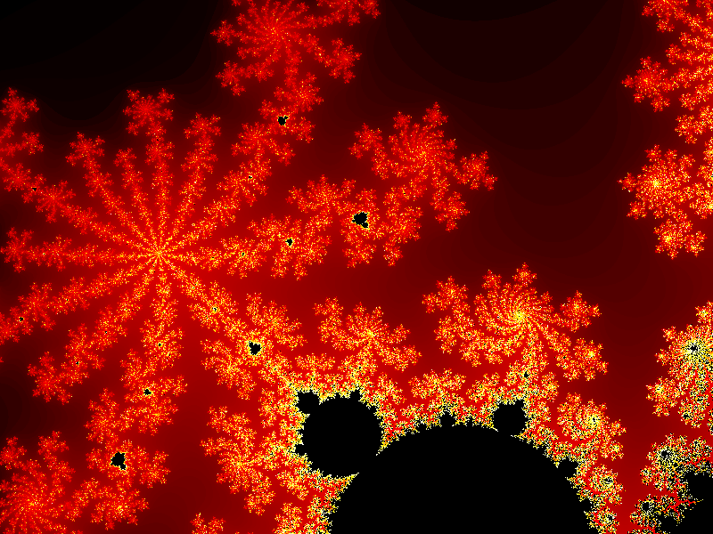

# 🌀 FractalCreator

A C++ application that generates **Mandelbrot set** fractal images and saves them as `.bmp` bitmap files. The program supports custom zoom levels and multi-range color gradients, allowing you to produce visually rich, detail-rich fractal renders.

---

## 🖼️ What it does

The program computes the Mandelbrot set over a pixel grid of configurable resolution. For each pixel, it determines how many iterations the Mandelbrot formula takes to diverge, then maps that value to a smooth color using a histogram-based equalization technique split across multiple color ranges. The final image is written to a standard 24-bit BMP file.

Key features:
- Iterative Mandelbrot computation with configurable max iterations
- Zoom stacking: apply multiple zoom transforms to explore any region of the fractal
- Multi-range color gradient: divide the iteration space into bands, each with its own start/end RGB color
- Histogram-equalized coloring for perceptually balanced output
- BMP output with proper file and info headers

---

## 🗂️ Project Structure

```
FractalCreator/
├── main.cpp
├── FractalCreator.h / .cpp
├── Mandelbrot.h / .cpp
├── Bitmap.h / .cpp
├── BitmapFileHeader.h
├── BitmapInfoHeader.h
├── ZoomList.h / .cpp
├── Zoom.h
├── RGB.h / .cpp
```

---

## 📦 Class Reference

### `main.cpp`
Entry point of the program. Creates a `FractalCreator` instance, registers color ranges and zoom levels, then calls `run()` to generate and save the image.

---

### `FractalCreator`
The central orchestrator of the rendering pipeline. It ties together all other components and exposes a simple public API.

**Responsibilities:**
- Holds the pixel iteration data (`m_fractal`) and the iteration frequency histogram (`m_histogram`)
- Manages the list of color ranges (`m_ranges`, `m_colors`, `m_rangeTotals`)
- Coordinates the full rendering pipeline via `run()`:
  1. `calculateIteration()` — computes Mandelbrot iterations for every pixel
  2. `calculateTotalIterations()` — sums the histogram for normalization
  3. `calculateRangeTotals()` — counts how many pixels fall in each color range
  4. `drawFractal()` — maps iterations to RGB colors and writes pixels to the bitmap
  5. `writeBitmap()` — saves the bitmap to disk

**Key methods:**
- `addRange(double rangeEnd, const RGB& color)` — defines a color range boundary and its starting color
- `addZoom(const Zoom& zoom)` — registers a zoom transform
- `run(const string& name)` — executes the full pipeline and saves the output BMP
- `getRange(int iterations)` — returns which color range a given iteration count belongs to

---

### `Mandelbrot`
Encapsulates the core mathematical logic of the Mandelbrot set.

**Responsibilities:**
- Provides the static method `getIterations(double x, double y)` which iterates the formula *z = z² + c* and returns the number of steps before divergence (or `MAX_ITERATIONS` if the point is inside the set)
- Defines `MAX_ITERATIONS = 500` as a class constant

---

### `Bitmap`
Handles in-memory representation of the image and BMP file output.

**Responsibilities:**
- Allocates a flat `uint8_t` pixel buffer of size `width × height × 3` (one byte per RGB channel)
- `setPixel(x, y, r, g, b)` — writes a pixel at the given coordinates (internally stores as BGR, as required by the BMP format)
- `write(const string& filename)` — serializes the pixel buffer to a valid 24-bit BMP file, prepending the file and info headers

---

### `BitmapFileHeader`
A plain `#pragma pack(1)` struct representing the 14-byte BMP file header.

**Fields:** magic bytes `BM`, total file size, two reserved fields, and the pixel data offset.

---

### `BitmapInfoHeader`
A plain `#pragma pack(1)` struct representing the 40-byte BMP info header (BITMAPINFOHEADER).

**Fields:** header size, image width and height, color planes, bits per pixel (24), compression, data size, resolution, and color table info.

---

### `ZoomList`
Manages a sequence of zoom transforms and converts pixel coordinates to fractal-space coordinates.

**Responsibilities:**
- Maintains a cumulative center `(m_xCenter, m_yCenter)` and scale factor `m_scale`
- `add(const Zoom& zoom)` — incorporates a new zoom, updating the center and scale accordingly
- `doZoom(int x, int y)` — maps a screen pixel `(x, y)` to its corresponding complex-plane coordinates `(xFractal, yFractal)`

The initial zoom added in `FractalCreator`'s constructor centers the view and sets the base scale so that the full Mandelbrot set fits within the image.

---

### `Zoom`
A simple data struct representing a single zoom operation.

**Fields:**
- `x`, `y` — the pixel coordinate to zoom into
- `scale` — the zoom factor (values < 1.0 zoom in)

---

### `RGB`
A lightweight struct holding a color as three `double` components (`r`, `g`, `b`).

**Responsibilities:**
- Used to define color range endpoints for the gradient coloring
- Supports subtraction via `operator-` to compute the difference between two colors, enabling linear interpolation

---

## 🔧 Build

The project uses standard C++11 (or later). You can compile it with `g++`:

```bash
g++ -std=c++17 -O2 -o fractal \
    main.cpp Bitmap.cpp FractalCreator.cpp \
    Mandelbrot.cpp RGB.cpp ZoomList.cpp
```

Or set it up as a CMake project.

---

## 🚀 Usage Example

```cpp
FractalCreator fractalCreator(800, 600);

// Define color gradient ranges (0.0 → 1.0 maps to 0 → MAX_ITERATIONS)
fractalCreator.addRange(0.0, RGB(0, 0, 0));       // black
fractalCreator.addRange(0.3, RGB(255, 0, 0));     // → red
fractalCreator.addRange(0.5, RGB(255, 255, 0));   // → yellow
fractalCreator.addRange(1.0, RGB(255, 255, 255)); // → white

// Zoom into a region of interest
fractalCreator.addZoom(Zoom(295, 202, 0.1));
fractalCreator.addZoom(Zoom(312, 304, 0.1));

// Generate and save
fractalCreator.run("output.bmp");
```

---

## 🖼️ Output Example



## 📄 License

This project was created for educational purposes.
